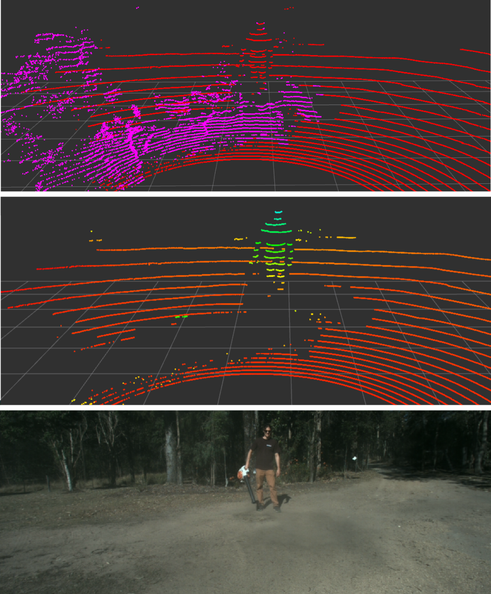
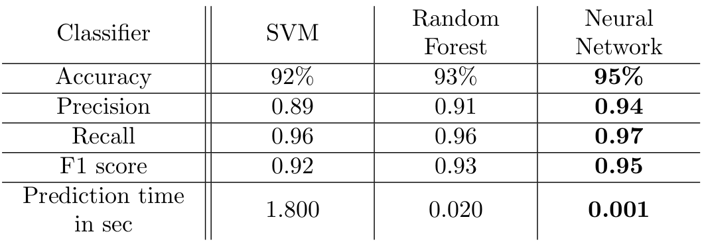
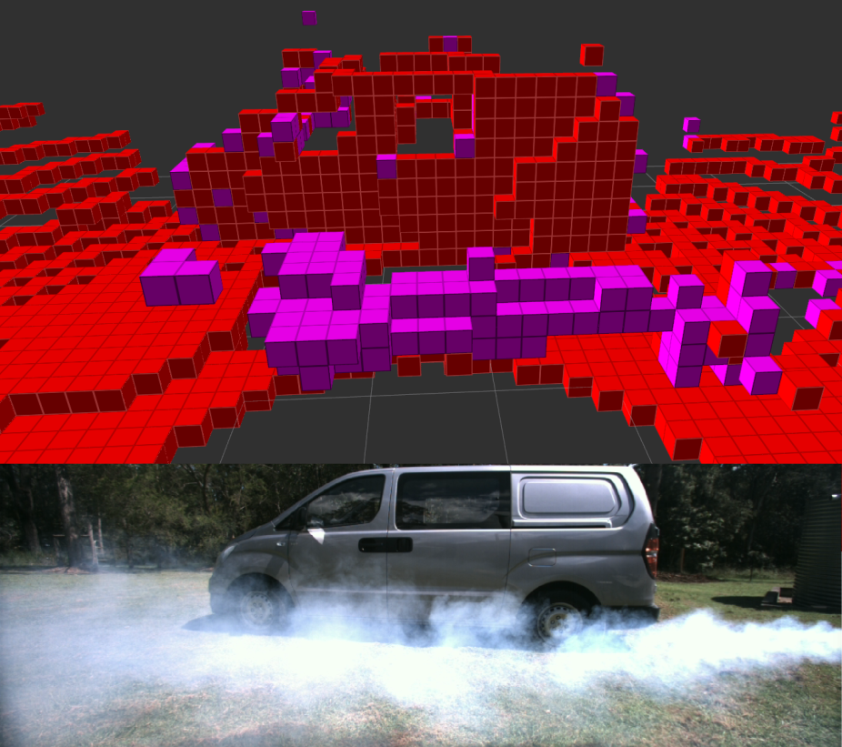
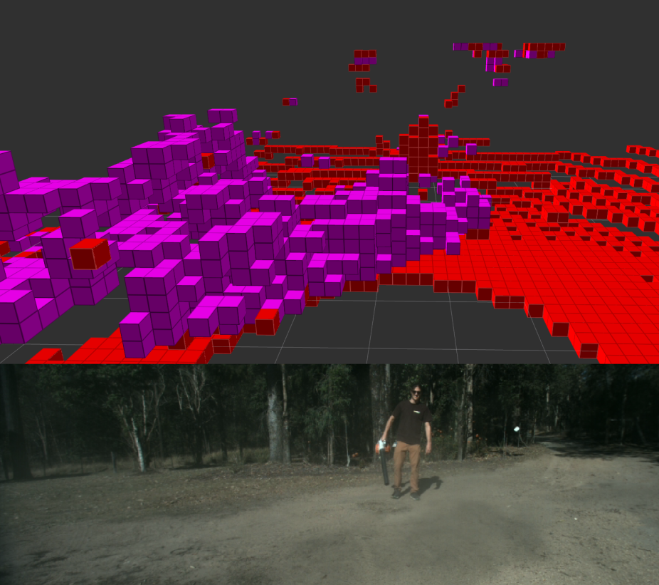
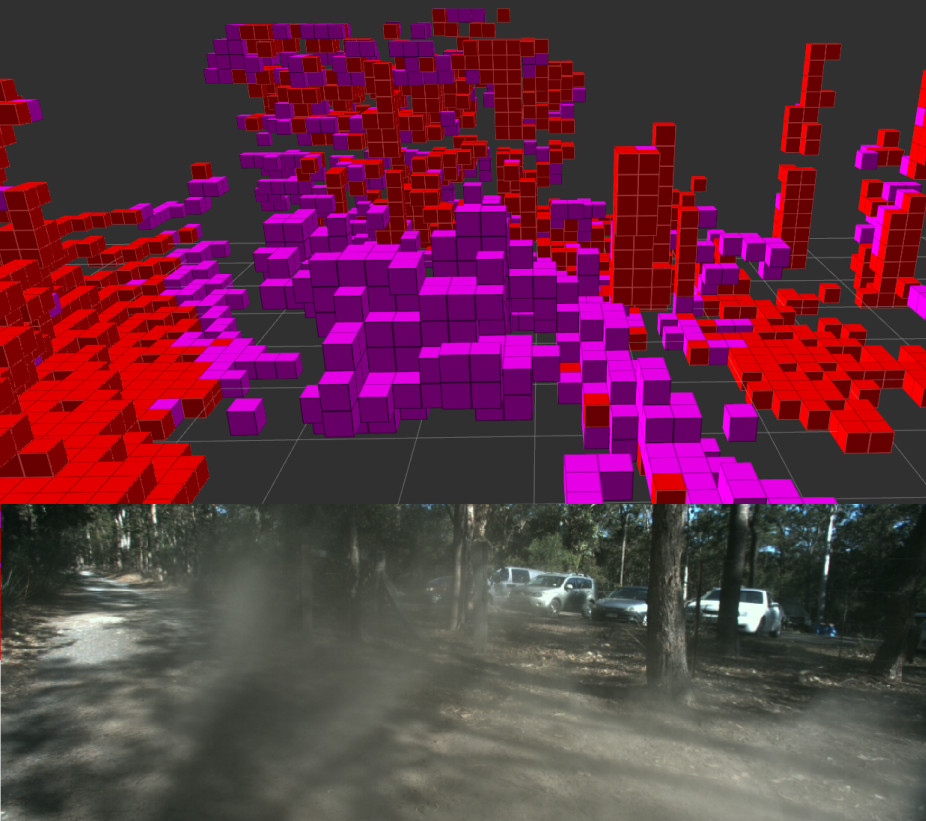

#Particle_detection

Airborne particles such as dust, smoke and fog have a significant detrimental impact on Lidar-based robotic perception systems. Lidar rays can reflect on these particles, leading modern perception methods to erroneous results, such as false obstacles or misclassified elements. We propose a method to detect airborne particles in 3D Lidar point clouds using classification from geometric features and Lidar intensity returns. We compare three different classifiers and we evaluate our approach using real dust and fog data collected in outdoor scenarios. We achieve an accuracy of up to 95\% in detecting airborne particles in Lidar point clouds, making our proposed method a promising solution for applications such as obstacle detection and object recognition in outdoor environments. 

Image showing the successful detection and segmentation of Lidar points generated by dust.

<h2>Quantitative Results</h2>

<h2>Quantitative Results</h2>

<h2>Video of experiments</h2>

Coming soon...

 
 

  <iframe
      src="https://www.youtube.com/embed/lI7oN7lyIb4"
      width="600"
      height="338"
      frameborder="0"
      allowfullscreen="">
  </iframe>

